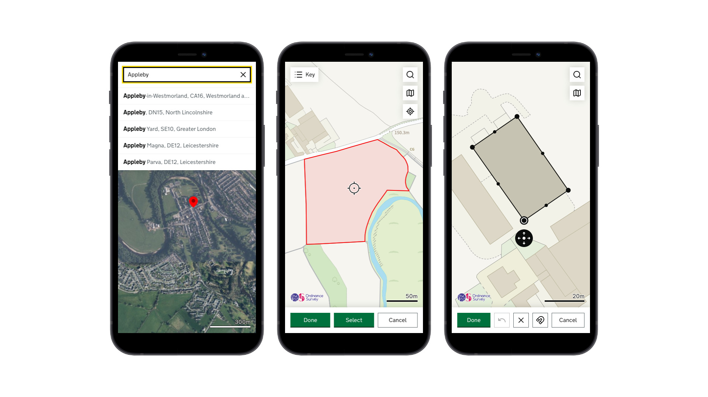

# InteractiveMap

**InteractiveMap** is a lightweight map component designed for public-facing government services, and available for anyone to use.
Built to GOV.UK standards, with accessibility at its core, Interactive Map supports a wide range of users across abilities, devices and input methods.
It is open source and works with multiple mapping engines. The component can be extended through plugins to meet the specific needs of a service.

See [examples of InteractiveMap](https://google.co.uk).

See [getting started](./docs/getting-started.md) developer guide.

**⚠️ This project is currently in beta and is not yet stable. Documentation and support are not yet available.**

  

## Documentation

[Getting started](./docs/getting-started.md)

[API Reference](./docs/api.md)

[Plugins](./docs/plugins.md)

[Building a Plugin](./docs/building-a-plugin.md)

[Architecture](./docs/architecture.md)

## Contributing

To follow...
